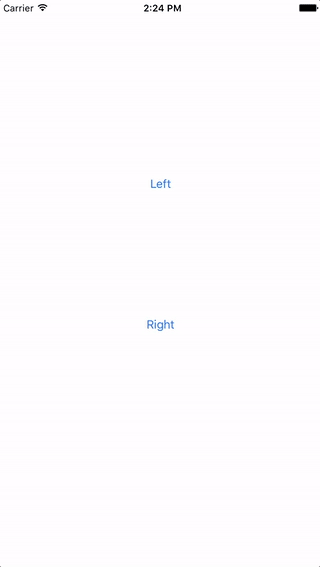

# Parallax Slide Menu

## Introduction

Left or Right slide menu with parallax effect.


## Demo

 


## How to Use & Config

Copy PLParallaxViewController.swift to your project directory.

In AppDelegate.swift:

```swift
func application(_ application: UIApplication, didFinishLaunchingWithOptions launchOptions: [UIApplicationLaunchOptionsKey: Any]?) -> Bool {
        // Override point for customization after application launch.
        
        setupParallexMenuViewController()
        return true
}

private func setupParallexMenuViewController() {
        let storyboard = UIStoryboard(name: "Main", bundle: nil)
        let mainViewController = storyboard.instantiateViewController(withIdentifier: "mainViewController") as! MainViewController
        let leftMenuViewController = storyboard.instantiateViewController(withIdentifier: "leftMenuTableViewController") as! LeftMenuTableViewController
        let rightMenuViewController = storyboard.instantiateViewController(withIdentifier: "rightMenuTableViewController")
        let menuViewController = PLParallaxViewController(withMainViewController: mainViewController, leftMenuViewController: leftMenuViewController, rightMenuViewController: rightMenuViewController)
        // Sample Configuration
        menuViewController.configBackground(withImage: UIImage(named: "backgroundImage")!)
        menuViewController.configRightSlideMenu(withOffsetY: 200, width: 150)
        menuViewController.configLeftSlideMenu(withOffsetY: 200, width: 150)
        menuViewController.configMainViewZoomedOffsetXWithSlideMenuShown(offsetX: 150)
        
        menuViewController.configLeftMenuGestureEnabled(enabled: true)
        menuViewController.configRightMenuGestureEnabled(enabled: true)
        
        window?.rootViewController = menuViewController
        window?.makeKeyAndVisible()
}
```


## All configurations

| Function                                 | Explanation                              |
| ---------------------------------------- | ---------------------------------------- |
| configBackground(withImage image: UIImage) | Set background image                     |
| configLeftSlideMenu(withOffsetY offsetY: CGFloat, width: CGFloat) | Set left slide menu offset Y and width   |
| configRightSlideMenu(withOffsetY offsetY: CGFloat, width: CGFloat) | Set right slide menu offset Y and width  |
| configSlideMenu(withOffsetY offsetY: CGFloat, width: CGFloat) | Set both left and right slide menu       |
| configLeftSlideMenuLandscape(withOffsetY offsetY: CGFloat) | Set left slide menu when device is landscape orientation |
| configRightSlideMenuLandscape(withOffsetY offsetY: CGFloat) | Set right slide menu when device is landscape orientation |
| configMainViewZoomedOffsetXWithLeftMenuShown(offsetX: CGFloat) | Set main menu offset X when left slide menu is presenting |
| configMainViewZoomedOffsetXWithRightMenuShown(offsetX: CGFloat) | Set main menu offset X when right slide menu is presenting |
| configMainViewZoomedOffsetXWithSlideMenuShown(offsetX: CGFloat) | Set the above two configurations with the same va |
| configBackgroundImageViewZoomScale(scale: CGFloat) | Set background image initial zoom scale  |
| configMainMenuViewZoomScale(scale: CGFloat) | Set main menu view zoom scale when slide menu is presenting |
| configLeftMenuGestureEnabled(enabled: Bool) | Enable or disable the left slide menu gesture |
| configRightMenuGestureEnabled(enabled: Bool) | Enable or disable the right slide menu gesture|
| configShowMenuAnimationDuration(second: Double) | Set the animation duration |
| configPreferredStatusBarStyleForMainMenu(style: UIStatusBarStyle) | Set status bar style when main menu is presenting |
| configPreferredStatusBarStyleForSlideMenu(style: UIStatusBarStyle)| Set status bar style when slide menu is presenting |

## Author

Paul Zhang